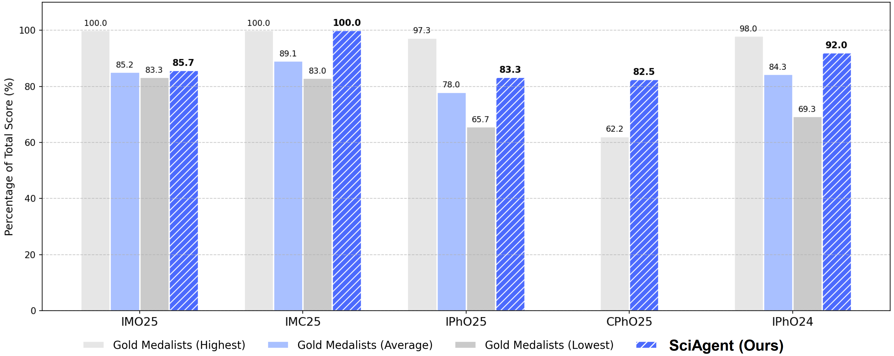
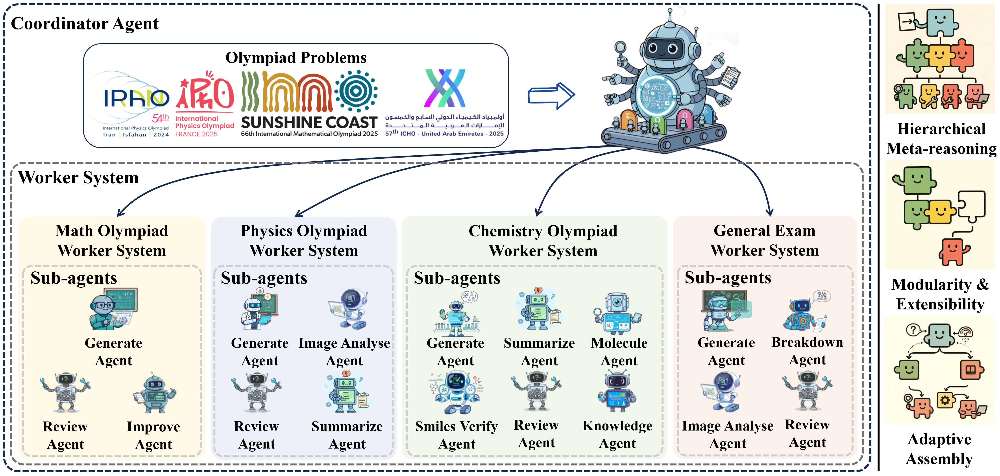

# SciAgent: A Unified Multi-Agent System for Generalistic Scientific Reasoning

<a href=https://arxiv.org/abs/2511.08151></a>
<a href=./docs/SciAgent_ZGCA.pdf></a>

<div>
Xuchen Li<sup>1,3</sup>,
Ruitao Wu<sup>1,4</sup>,
Xuanbo Liu<sup>1,4</sup>,
Xukai Wang<sup>1,3</sup>,
Jinbo Hu<sup>5</sup>,
Zhixin Bai<sup>1,6</sup>,
Bohan Zeng<sup>5</sup>,
Hao Liang<sup>1,5</sup>,
Leheng Chen<sup>1,5</sup>,
Mingrui Chen<sup>1,3</sup>,
Haitian Zhong<sup>1,3</sup>,
Xuanlin Yang<sup>1,5</sup>,
Xu-Yao Zhang<sup>3</sup>,
Liu Liu<sup>4</sup>,
Jia Li<sup>4</sup>,
Kaiqi Huang<sup>3</sup>,
Jiahao Xu<sup>2</sup>,
Haitao Mi<sup>2</sup>,
Wentao Zhang<sup>1,5</sup>,
Bin Dong<sup>1,5</sup>
</div>
<div>
    <sup>1</sup>Zhongguancun Academy
    <sup>2</sup>Tencent AI Lab
    <sup>3</sup>Institute of Automation, Chinese Academy of Sciences
    <sup>4</sup>Beihang University
    <sup>5</sup>Peking University
    <sup>6</sup>Nanjing University
</div>

---

Official implementation of [**SciAgent: A Unified Multi-Agent System for Generalistic Scientific Reasoning**](https://arxiv.org/abs/XXXX.XXXXX)

|  |
|:--:|
|We compare SciAgent's performance (represented by the striped blue bars) with the highest, average, and lowest gold medalist scores across five competitions: IMO25, IMC25, IPhO25, CPhO25 and IPhO24. Our SciAgent achieves gold medal performance in all tasks, surpassing the average gold medalist score, and its performance in IMC25 and CPhO25 is on par with or even exceeds the highest human gold medalist scores.|

---

> **Abstract**: Recent advances in large language models have enabled AI systems to achieve expert-level performance on domain-specific scientific tasks, yet these systems remain narrow and handcrafted. We introduce SciAgent, a unified multi-agent system designed for generalistic scientific reasoning—the ability to adapt reasoning strategies across disciplines and difficulty levels. SciAgent organizes problem solving as a hierarchical process: a Coordinator Agent interprets each problem’s domain and complexity, dynamically orchestrating specialized Worker Systems, each composed of interacting reasoning Sub-agents for symbolic deduction, conceptual modeling, numerical computation, and verification. These agents collaboratively assemble and refine reasoning pipelines tailored to each task. Across mathematics and physics Olympiads (IMO, IMC, IPhO, CPhO), SciAgent consistently attains or surpasses human gold-medalist performance, demonstrating both domain generality and reasoning adaptability. Additionally, SciAgent has been tested on the International Chemistry Olympiad (IChO) and selected problems from the Humanity’s Last Exam (HLE) benchmark, further confirming the system’s ability to generalize across diverse scientific domains. This work establishes SciAgent as a concrete step toward generalistic scientific intelligence—AI systems capable of coherent, cross-disciplinary reasoning at expert levels.

## Overview

- **Conceptual contribution:** We introduce generalistic scientific reasoning as a new paradigm for AI in science, emphasizing adaptability across domains and modalities.

- **Architectural innovation:** We propose a Coordinator–Worker–Sub-agents hierarchy in which the Coordinator performs domain-adaptive routing and the Worker Systems self-assemble internal multi-agent pipelines.

- **Dynamic reasoning mechanism:** We demonstrate self-assembling, feedback-driven reasoning loops that integrate symbolic deduction, conceptual modeling, and quantitative computation.

- **Empirical validation:** We show that SciAgent achieves gold-medal-level performance on IMO 2025, IMC 2025, IPhO 2024/2025, and CPhO 2025, and maintains strong generalization on IChO 2025 and the Humanity’s Last Exam benchmark—providing evidence of reasoning transfer rather than narrow specialization.

|  |
|:--:|
|SciAgent consists of a hierarchical multi-agent framework with a Coordinator Agent that routes problems to domain-specific Worker Systems. Each Worker System—Math, Physics, Chemistry, and General Exam—contains multiple Sub-agents (e.g., Generator, Reviewer, Image Analyser) collaborating through adaptive reasoning loops. The right panel summarizes key design principles: hierarchical meta-reasoning, modularity, and adaptive assembly.|

## TODO 🚀

- [] Release the code of SciAgent framework.

- [] Release the code of Math Olympiad Worker System.

- [] Release the code of Physics Olympiad Worker System.

- [] Release the code of Chemistry Olympiad Worker System.

- [] Release the code of General Exam Worker System.

## BibTeX

```
@article{sciagent-zgca,
  title={SciAgent: A Unified Multi-Agent System for Generalistic Scientific Reasoning},
  author={Xuchen Li, Ruitao Wu, Xuanbo Liu, Xukai Wang, Jinbo Hu, Zhixin Bai, Bohan Zeng, Hao Liang, Leheng Chen, Mingrui Chen, Haitian Zhong, Xuanlin Yang, Xu-Yao Zhang, Liu Liu, Jia Li, Kaiqi Huang, Jiahao Xu, Haitao Mi, Wentao Zhang, Bin Dong},
  journal={arXiv preprint arXiv:2511.08151},
  year={2025}
}
```

## Acknowledgement

This code is heavily inspired by [Somlagents](https://github.com/huggingface/smolagents), [IMO25](https://github.com/lyang36/IMO25) and [Physics-Supernova](https://github.com/CharlesQ9/Physics-Supernova). Thank you for your outstanding work!


## License

This repository is licensed under the [Apache License Version 2.0](./LICENSE). You are free to use, modify, and distribute this code in compliance with the terms and conditions of the Apache License Version 2.0.
