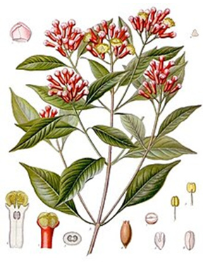
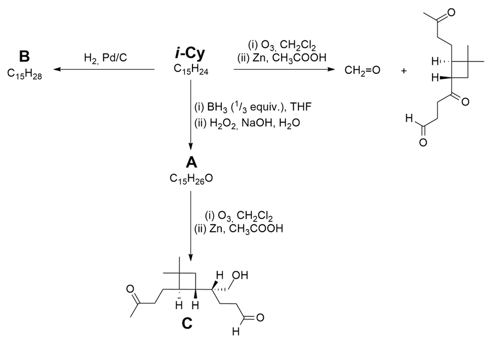
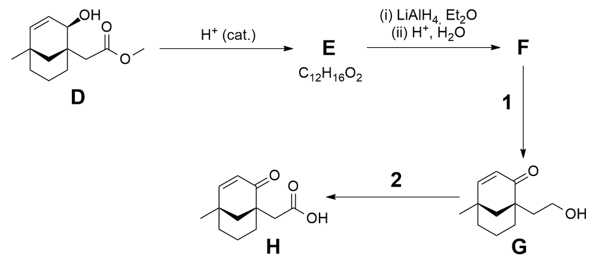
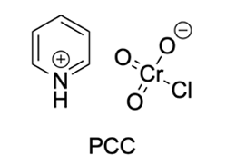
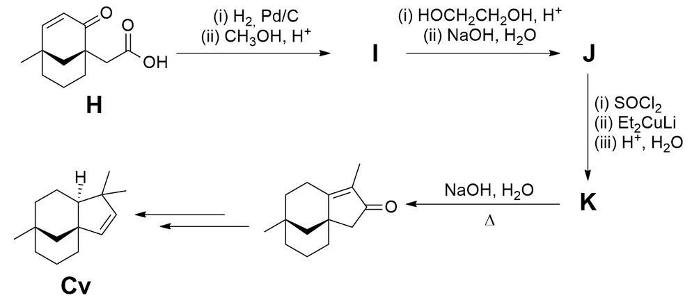
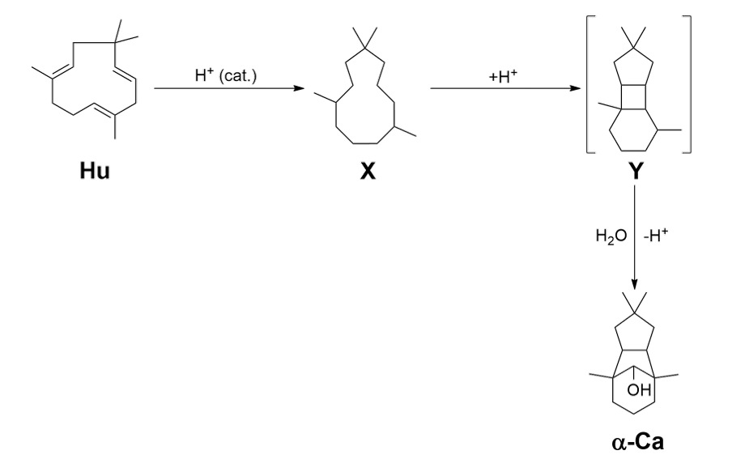
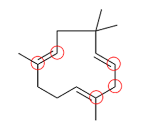

# 1. Isocaryophyllene, clovene, and humulene

Sesquiterpenes have the formula C₁₅H₂₄. They are secondary metabolites in plants and both deter insects which eat plants and attract animals which eat the insects.

Isocaryophyllene (**i-Cy**) is a sesquiterpene found in oregano, rosemary, pepper, and cloves.

The structural formula of **i-Cy** can be determined by performing various reactions and analysing the products as shown in the figure.

equiv. = translation 'equiv.'

**1.1 Draw** the structures of **i-Cy**, **A**, and **B**. Stereochemistry is not required.

**1.2 Circle** the stereocentres in compound **C** and **assign** them as *R* or *S*.

Clovene (**Cv**) can be synthesised from **i-Cy** under acid catalysis. The synthesis of **Cv** starts from compound **D**.

H⁺ (cat.)="translation H⁺ (cat.)"

**1.3 Draw** the structures of compounds **E** and **F**. Stereochemistry is not required.

For steps '**1**' and '**2**' several reagents could be considered. For example:

□ PCC

□ K₂Cr₂O₇, H₂SO₄, H₂O

□ MnO₂

□ (i) OsO₄, (ii) KHSO₃

**1.4** From the reagents above, **tick** which one(s) would be suitable for step '**1**'.

**1.5** From the reagents above, **tick** which one(s) would be suitable for step '**2**'.

The final part of the synthesis is shown.

**1.6 Draw** the structures of compounds **I**, **J**, and **K**. Stereochemistry is not required.

Humulene (**Hu**) is another sesquiterpene. It can be converted to α-caryophyllene alcohol (**α-Ca**), which is similar in structure to **Cv**. This conversion is an acid-catalysed hydration reaction which takes place via multiple intermediate structures. Incomplete structures of some intermediates, **X** and **Y**, are shown.

H⁺ (cat.)="translation H⁺ (cat.)"

The transformation from **Hu** to **X** is an acid-catalysed isomerisation reaction.
Intermediate **Y** is charged.

**1.7 Complete** the structure of intermediate **X** by adding double bonds in the correct places.

**1.8 Complete** the structure of intermediate **Y** by adding a positive charge in the correct place.

Five carbon atoms are circled in **Hu**. Through understanding the mechanism we can determine where these five carbon atoms end up in **α-Ca**.

**1.9 Circle** the five corresponding carbon atoms in **α-Ca** which are circled in **Hu**.

