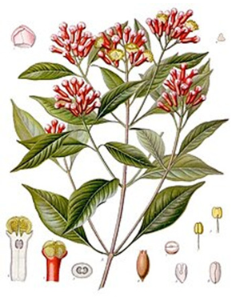

# 1. Isocaryophyllene, clovene, and humulene

Sesquiterpenes have the formula C₁₅H₂₄. They are secondary metabolites in plants and both deter insects which eat plants and attract animals which eat the insects.

Isocaryophyllene (**i-Cy**) is a sesquiterpene found in oregano, rosemary, pepper, and cloves.

The structural formula of **i-Cy** can be determined by performing various reactions and analysing the products as shown in the figure.

equiv. = translation 'equiv.'

**1.1 Draw** the structures of **i-Cy**, **A**, and **B**. Stereochemistry is not required.

**Note**: When you want to describe the structure of a chemical substance, please follow the **Simplified Molecular Input Line Entry System (SMILES)** specification for output.