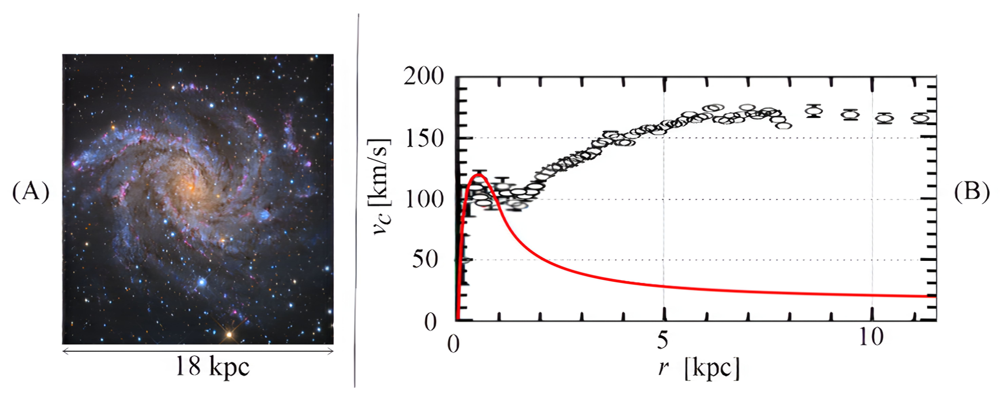
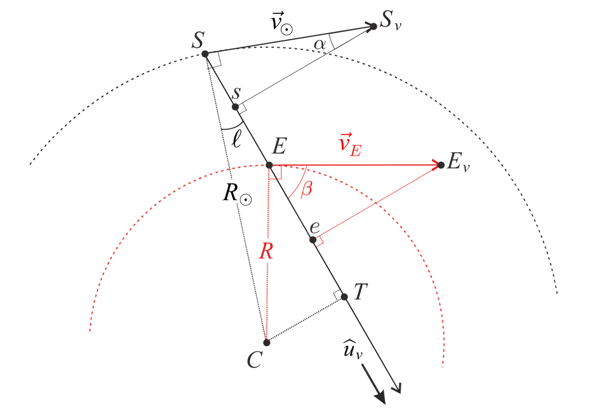
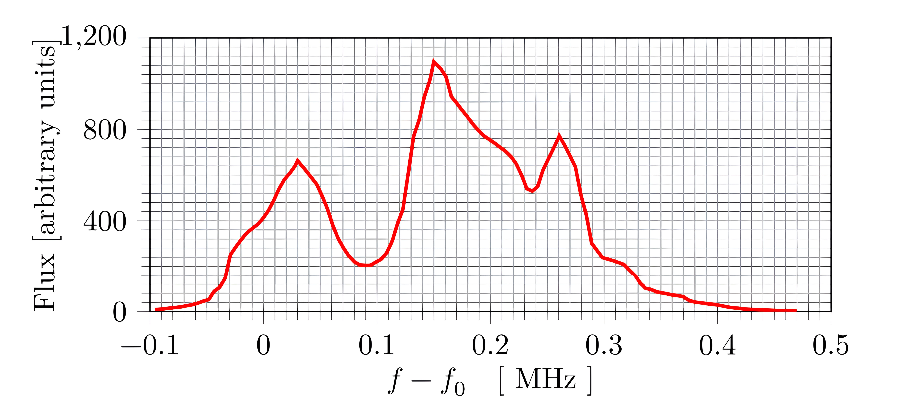
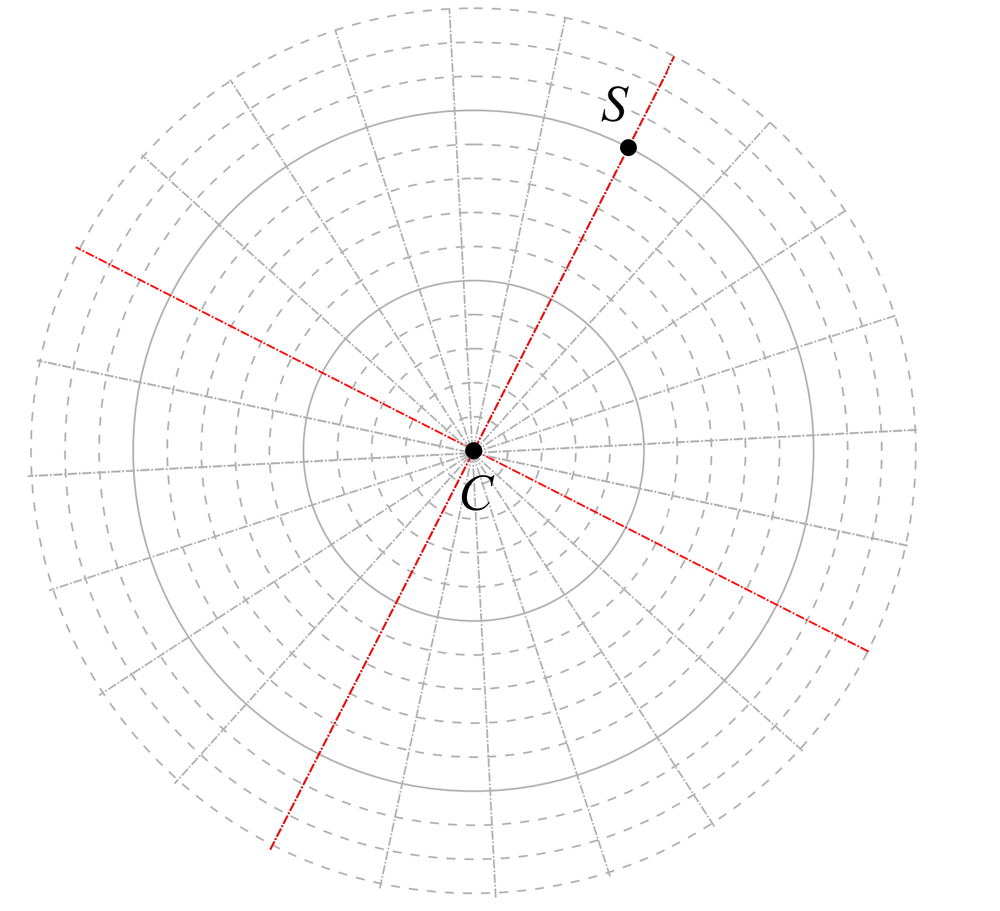
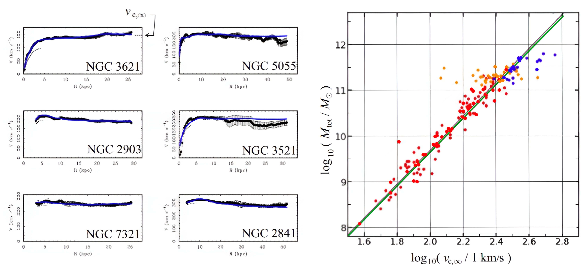

# Hydrogen and galaxies (10 points)

This problem aims to study the peculiar physics of galaxies, such as their dynamics and structure. In particular,we explain how to measure the mass distribution of our galaxy from the inside. For this we will focus on hydrogen, its main constituent.

Throughout this problem we will only use $\hbar$, defined as $\hbar=h/2\pi$

## Part A - Introduction.

### Bohr model

We assume that the hydrogen atom consists of a non-relativistic electron,with mass $m_{e}$ orbiting a fixed proton. Throughout this part,we assume its motion is on a circular orbit

A.1 Determine the electron's velocity $v$ in a circular orbit of radius $r$. 

In the Bohr model, we assume the magnitude of the electron's angular momentum $L$ is quantized, $L = n\hbar$, where $n > 0$ is an integer. We define $\alpha = \frac{e^2}{4\pi\epsilon_0\hbar c} \approx 7.27\times 10^{-3}$.

A.2 Show that the radius of the orbit is given by $r_n=n^2r_1$, where $r_1$ is called the Bohr radius. Express $r_1$ in terms of $\alpha$, $m_e$, $c$, and $h$ and calculate its numerical value with 3 digits. Express $v_1$, the velocity on the orbit of radius $r_1$, in terms of $\alpha$ and $c$.

A.3 Determine the electron's mechanical energy $E_n$ on an orbit of radius $r_n$ in terms of $e$, $ε_0$, $r_1$, $n$. Determine $E_1$ in the ground state in terms of $\alpha$, $m_e$, and $c$. Compute its numerical value in eV.

### Hydrogen fine and hyperfine structures

The rare spontaneous inversion of the electron's spin causes a photon to be emitted on average once per 10 million years per hydrogen atom. This emission serves as a hydrogen tracer in the universe and is thus fundamental in astrophysics. We will study the transition responsible for this emission in two steps.

First,consider the interaction between the electron spin and the relative motion of the electron and the proton. Working in the electron's frame of reference,the proton orbits the electron at a distance $r_1$ . This produces a magnetic field $\vec{B}_{1}$

A.4 Determine the magnitude $B_{1}$ of $\vec{B}_{1}$ at the position of the electronin terms of $\mu_0$, e,α,c and $r_1$

Second,the electron spin creates a magnetic moment ${\vec{\mathcal{M}}}_{s}$ . Its magnitude is roughly ${\mathcal{M}}_{s}=\frac{e}{m_{e}}\hbar.$ The fine (F) structure is related to the energy difference $\Delta E_{\mathrm{HF}}$ between an electron with a magnetic moment $\vec{\mathcal{U}}_{s}$ parallel to $\vec{B}_{1}$ and that of an electron with $\vec{\mathcal{M}}_{s}$ anti-parallel to $\overrightarrow{B}_{1}$ .Similarly, the hyperfine (HF) structure is related to the energy difference $\Delta E_{\mathrm{HF}}$ due to the interaction between parallel and anti-parallel magnetic moments of the electron and the proton. It is known to be approximately $\Delta E_{\mathrm{HF}}\simeq3.72\frac{m_{e}}{m_{p}}\Delta E_{\mathrm{F}}$ where $m_{p}$ is the proton mass.

A.5 Express $\Delta E_{\mathrm{F}}$ as a function of $\alpha$ and $E_{1}$. Express the wavelength $\lambda_\mathrm{HF}$ of a photon emitted during a transition between the two states of the hyperfine structure and give its numerical value with two digits.

### Part B - Rotation curves of galaxies.

### Data

 Kiloparsec: $1\ker=3.09\times10^{19}$m. Solar mass: 1 $\mathbf{M} _\odot = 1. 99\times 10^{30}$kg.

We consider a spherical galaxy centered around a fixed point O .At any point $P$ ，let $\rho=\rho(P)$ be the volumetric mass density and $\varphi=\varphi(P)$ the associated gravitational potential (i.e. potential energy per. unit mass). Both $\rho$ and $\varphi$ depend only on $r=\left\|\overrightarrow{OP}\right\|$ . The motion of a mass $m$ located at $P$ , due to the field $\varphi$, is restricted to a plane containing O.

B.1 In the case of a circular orbit,determine the velocity $v_c$ of an object on a circular orbit passing through $P$ in terms of $r$ and $\frac{d\varphi}{dr}$.

Fig. 1(A)is a picture of the spiral galaxy NGC 6946 in the visible band (from the $0.8m$ Schulman Telescope at the Mount Lemmon Sky Center in Arizona). The little ellipses in Fig.1 (B) show experimental measurements of $v_{c}$ for this galaxy. The central region $(r<1 kpc)$ is named the bulge. In this region, the mass distribution is roughly homogeneous. The red curve is a prediction for $\nu_{c}$ if the systemwerehomoge neous in the bulge and keplerian $(\varphi(r)=-\beta/r$ with $\beta>0$ )outside it,i.e.considering that the total mass of the galaxy is concentrated in the bulge.

Fig. 1: NGC 6946 galaxy: Picture (A) and rotation curve (B)

B.2 Deduce the mass $M_{b}$ of the bulge of NGC 6946 from the red rotation curve in Fig. 1(B), in solar mass units.

Comparing the keplerian model and the experimental data makes astronomers confident that part of themass is invisibie in the picture.They thus suppose that the galaxy's actual mass density is given by

$$\rho_m(r)=\frac{C_m}{r_m^2+r^2}$$

where $C_{m}>0$ and $r_m>0$ are constants.

B.3Show that the velocity profile $\nu_{c,m}(r)$ , corresponding to the mass density in Eq.1, can be written $v_{c,m}(r)=\sqrt{k_{1}-\frac{k_{2}\cdot\arctan(\frac{r}{r_{m}})}{r}}$ . Express $k_1$ and $k_2$ in terms of $C_{m},r_m$ rn $r_{m}$ and $G$.

( Hints: $\int_{0}^{r}\frac{x^{2}}{a^{2}+x^{2}}dx=r-a$ arctan $(r/a)$ and: arctan $(x)\simeq x-x^{3}/3$ for $x\ll1$ ） Simplify $v_{c,m}(r)$ when $r\ll r_m$ and when $r\gg r_m$ Show that if $r\gg r_m$ ,the mass $M_m(r)$ embedded in a sphere of radius $r$ withthe mass density given by Eq. 1 simplifies and depends only on $C_{m}$ and $r$ Estimate the mass of the galaxy NGC 6946 actually present in the pictureinFig 1(A).

# Part C - Mass distribution in our galaxy.

For a spiral galaxy,the modelfor Eq.1 is modified and one usually considers the gravitational potential is given by $\varphi_{G}\left(r,z\right)=\varphi_{0}\ln\left(\frac{r}{r_{0}}\right)\exp\left[-\left(\frac{z}{z_{0}}\right)^{2}\right]$, where $z$ is the distance to the galactic plane defined by $z=0$ ),and $r<r_0$ is now the axial radius and $\varphi_{0}>0$ a constant to be determined. $r_{0}$ and $z_0$ are constant values.

C.1 Find the equation of motion on $z$ for the vertical motion of a point mass $m$ in such a potential, assuming $r$ is constant. Show that, if $r<r_{0r}$ the galactic plane is a stable equilibrium state by giving the angular frequency $\omega_0$ of small oscillations around it.

From here on,we set $z=0$

C.2 Identify the regime, either $r >> r_m$ or $r << r_m$, in which the model of Eq. 1 recovers potential $\varphi_\omega(r, 0)$ with a suitable definition of $\varphi_0$. Under this condition, $v_c(r)$ no longer depends on $r$. Express this condition in terms of $\varphi_0$.

Therefore, outside the bulge the velocity modulus $v_c$ does not depend on the distance to the galactic center. We will use this fact,as astronomers do,to measure the galaxy's mass distribution from the inside.

All galactic objects considered here for astronomical observations, such as stars or nebulae, are primarily composed of hydrogen. Outside the bulge,we assume that they rotate on circular orbits around the galactic center C. S is the sun's position and $E$ that of a given galactic object emitting in the hydrogen spectrum. In the galactic plane, we consider a line of sight $SE$ corresponding to the orientation of an observation, on the unit vector. $\hat{u}_{v}$ (see Fig. 2)

Fig. 2: Geometry of the measurement

Let $\ell$ be the galactic longitude, measuring the angle between SC and the SE.The sun's velocity on its circular orbit of radius $R_{\odot}=8.00$kpc is denoted $\vec{v}_{\odot}$ . A galactic object in $E$ orbits on another circle of radius $R$ at velocity $\vec{v}_{E}$ .Using a Doppler effect on the previously studied $21cm$ line, one can obtain the relative radial velocity $v_{rE/S}$ of the emitter $E$ withrespect to the sun $S:$ it is theprojection of $\tilde{v}_{E}-\tilde{v}_{\odot}$ on the line of sight.

C.3 Determine $v_{rE/S}$ in terms of $\ell$, $R$ ,$R_{\circ}$ and $V_{0}$ . Then, express $R$ in terms of $R_{\odot}$ $v_{\odot}$ ，and $v_{rE/S}$

Using a radio telescope, we make observations in the plane of our galaxy toward a longitude $\ell=30^\circ$ .The frequency band used contains the 2lcm line,whose frequency is $f_{0}=1.42$GHz The results are ported in Fig. 3.

Fig. 3: Electromagnetic signal as a function of the frequency shift, measured in the radic frequency band at $\ell=30^{\circ}$ using EU-HOU RadioAstronomy

C.4 In our galaxy, $v_{\odot} = 220 \text{ km s}^{-1}$. Determine the values of the relative radial velocity (with 3 significant digits) and the distance from the galactic center (with 2 significant digits) of the 3 sources observed in Fig. 3. Distances should be expressed as multiples of $R_\odot$. 
C.5 On the top view of our galaxy (in Fig. 3-Answer), indicate the positions of the 3 sources observed in Fig. 3. What could be deduced from repeated measurements changing $\ell$?

Fig. 3-Answer. Top view of our galaxy.

### Part D - Tully-Fisher relation and MOND theory.

The flat external velocity curve of NGC 6946 in Fig. 1 is a common property of spiral galaxies, as can be seen in Fig.4(left).Plotting the external constant velocity value $v_{c,\infty}$ as a function of the measured total mass $M_{\mathrm{tot}}$ of each galaxy gives an interesting correlation called the Tully-Fischer relation, see Fig. 4 (right).

Fig. 4. Left: Rotation curves for typical spiral galaxies -Right: $\log_{10}(M_{\mathrm{tot}})$ as a function of $\log_{10}(v_{c,\infty})$ on linear scales. Colored dots correspond to different galaxies and different surveys. The green line is the Tully-Fischer relation which is in very good agreement with the best fit line of the data (in black)

D.1 Assuming that the radius R of a galaxy doesn't depend on its mass, show that the model of Eq.1 (part B) gives a relation of the form $M_{\mathrm{tot}}=\eta v_{\varepsilon,\infty}^{\gamma}$ where $\gamma$ and $\eta$ should be specified. Compare this expression to the Tully-Fischer relation by computing $\gamma_{TF}$

In the extremely low acceleration regime,of the order of $a_{0}=10^{-10}$m$\cdot\mathrm{s}^-2$ ,the Modified Newtonian Dynamics (MOND) theory suggests that one can modify Newton' second law using $\overrightarrow{F}=m\mu\left(\frac{a}{a_{0}}\right)\overrightarrow{a}$ where $a=\left\|\vec{a}\right\|$ is the modulus of the acceleration and the $\mu$ function is defined by $\mu(x)=\frac{x}{1+x}$

D.2 Using data for NGC 6946 in Fig. 1,estimate,within Newton's theory,the modulus of the acceleration $a_{m}$ of a mass in the outer regions of NGC 6946.

D.3 Let $m$ be a mass on a circular orbit of radius $r$ with velocity $v_{c,\infty}$ in the gravity field of a fixed mass $M$. Within the MOND theory, with $a \ll a_0$, determine the Tully-Fisher exponent. Using data for NGC 6946 and/or Tully-Fisher law, calculate $a_0$ to show that MOND operates in the correct regime.

D.4 Considering relevant cases, determine $v_c(r)$ for all values of $r$ in the MOND theory in the case of a gravitational field due to a homogeneously distributed mass M with radius $R_{b}$