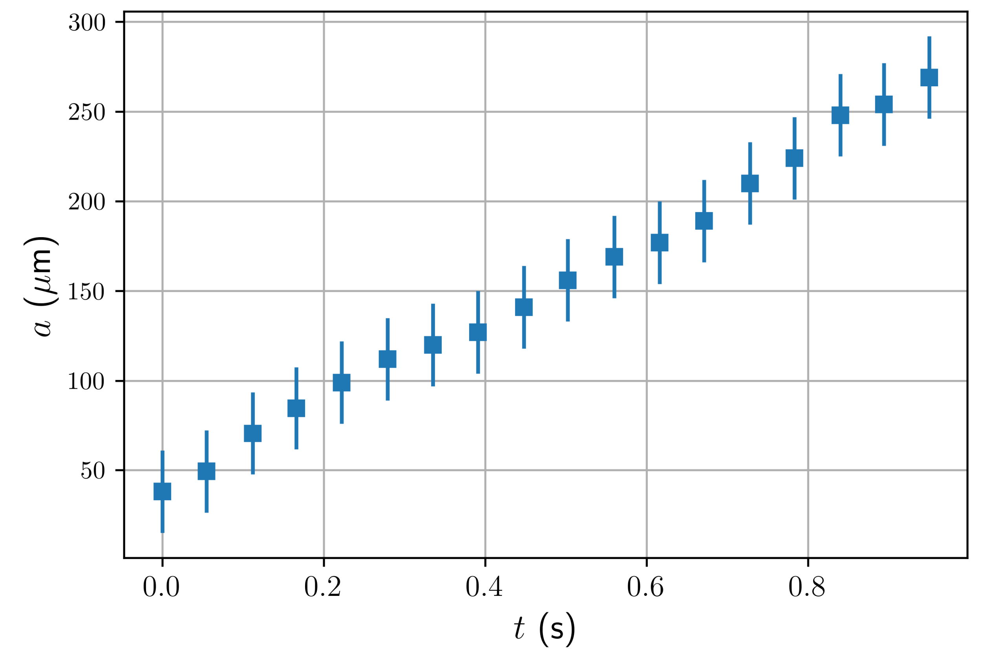
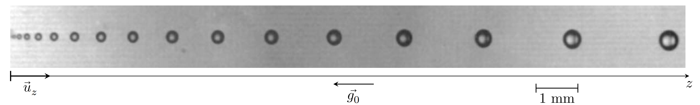
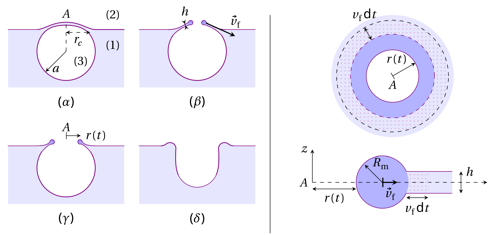
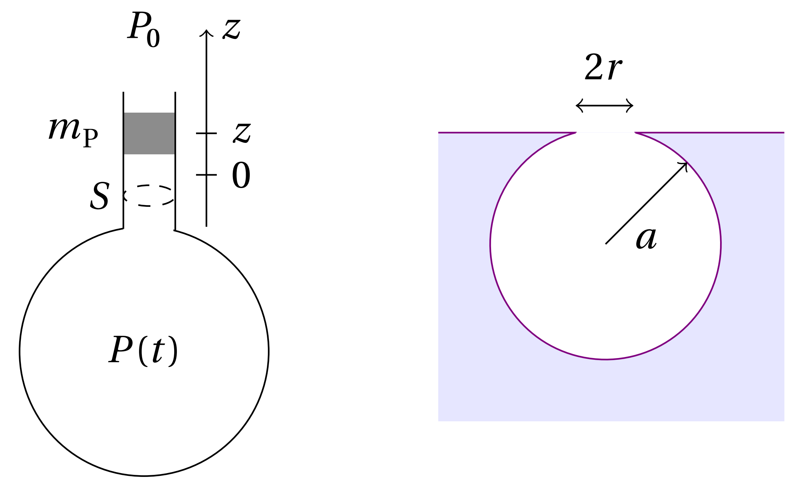
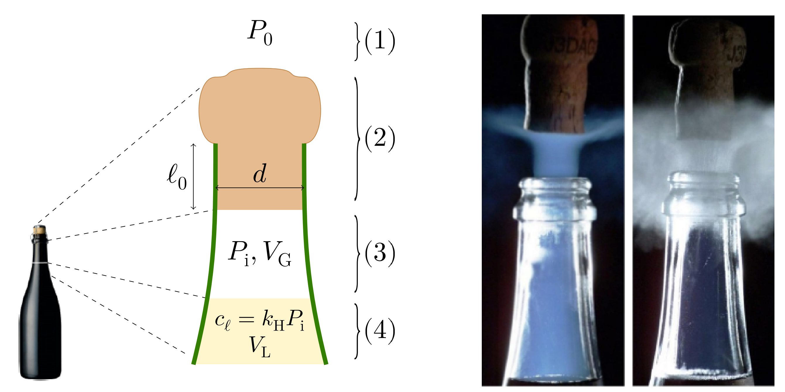

# Champagne! (10 points)

Warning: Excessive alcohol consumption is harmful to health and drinking alcohol below legal age is. prohibited.

Champagne is a French sparkling wine. Fermentation of sugars produces carbon dioxide $(\mathrm{CO}_{2})$ in the bottle. The molar concentration of $\mathrm{CO}_{2}$ in the liquid phase $c_{l}$ and the partial pressure $P_{\mathrm{CO}_2}$ in the gas phase are related by $c_{l}=k_{\mathrm{H}}P_{\mathrm{CO}_{2}}$ known as Henry's law and where $k_{\mathrm{H}}$ is called Henry's constant.

## Data

·Surface tension of champagne $\sigma=47\times10^{-3}$J$\cdot\mathrm{m}^-2$ 

·Density of the liquid $\rho_{l}=1.0\times10^{3}$kg$\cdot m^- 3$ 

·Henry's constant at $T_{0}=20^{\circ}\mathrm{C}_{r}$ , $k_{\mathrm{H} }( 20^{\circ }$C$)=3.3\times10^{-4}$mol$\cdot\mathrm{m}^-3\cdot\mathrm{Pa}^{-1}$ 

·Henry's constant at $T_{0}=6^{\circ}\mathrm{C}_{r}$, $k_{\mathrm{H} }( 6^{\circ }$C$)=5.4\times10^{-4}$mol$\cdot\mathrm{m}^-3\cdot\mathrm{Pa}^{-1}$ 

Atmospheric pressure $P_{0}=$1 bar$=1.0\times10^5$Pa

Gases are ideal with an adiabatic coefficient $\gamma=1.3$

## Part A. Nucleation, growth and rise of bubbles

Immediately after opening a bottle of champagne at temperature. $T_{0}=20^{\circ}$C ,we fill a glass. The pressure in the liquid is $P_0$ and its temperature stays constant at $T_{0}$ . The concentration $c_{l}$ of dissolved $\mathrm{CO}_{2}$ exceeds the equilibrium concentration and we study the nucleation of a $\mathrm{CO}_{2}$ bubble.We note $a$ its radius and $P_{\mathrm{b}}$ its inner pressure.

A.1 Express the pressure $P_{\mathrm{b}}$ in terms of $P_0$ ,a and $\sigma$

In the liquid, the concentration of dissolved $\mathrm{CO}_{2}$ depends on the distance to the bubble. At long distance we recover the value $c_{l}$ and we note $c_\mathrm{b}$ the concentration close to the bubble surface. According to Henry's law, $c_{\mathrm{b}}=k_{\mathrm{H}}P_{\mathrm{b}}$ .We furthermore assume in all the problem that bubbles contain only $\mathrm{CO}_{2}$

Since $c_{l}\neq c_{\mathrm{b}}.$ $\mathrm{CO}_{2}$ molecules diffuse from areas of high to low concentration. We assume also that any molecule from the liquid phase reaching the bubble surface is transferred to the vapor.

A.2 Express the critical radius $a_{\mathrm{c}}$ above which a bubble is expected to grow in terms of $P_0,\sigma,c_l$ and $c_0$ where $c_0=k_\mathrm{H}P_0$ . Calculate numerically $a_{\mathrm{c}}$ for $c_{l}=4c_{0}$

In practice, bubbles mainly grow from pre-existing gas cavities. Consider then a bubble with initial radius $a_{0}\approx40$ μm The number of moles of $\mathrm{CO}_{2}$ transferred at the bubble's surface per unit area and time is noted $j$ Two models are possible for $j$

 model (1) $j=\frac{D}{a}(c_{l}-c_{\mathrm{b}})$ where $D$ is the diffusion coefficient of $\mathrm{CO}_{2}$ in the liquid 

model (2) $j= K( c_{l }- c_{\mathrm{b} })$ where $K$ is a constant here.

Experimentally, the bubble radius $a(t)$ is found to depend on time as shown in Fig.2. Here $c_{l}\approx4c_{0}$ and since bubbles are large enough to be visible,the excess pressure due to surface tension can be neglected and $P_{\mathrm{b}}\approx P_{0}$

A.3 Express the number of $\mathrm{CO}_{2}$ moles in the bubble $n_{c}$ in terms of $a,P_{0},T_{0}$ To $T_{0}$ and ideal gas constant R. Find $a(t)$ for both models. Indicate which model explains the experimental results in Fig. 2. Depending on your answer, calculate numerically $K$ or $D$

Fig. 2. Time evolution of $\mathrm{CO}_{2}$ bubble radius in a glass of champagne(adapted from [1])

Eventually bubbles detach from the bottom of the glass and continue to grow while rising. Fig. 3. shows a train of bubbles. The bubbles of the train have the same initial radius and are emitted at a constant frequency $f_{\mathrm{b}}=20$Hz

Fig. 3. A train of bubbles. The photo is rotated horizontally for the page layout.

For the range of velocities studied here, the drag force $F$ on a bubble of radius a moving at velocity $v$ in a liquid of dynamic viscosity $\eta$ is given by Stokes'law $F=6\pi\eta av$ . Measurements show that at any moment in time, the bubble can be assumed to be traveling at its terminal velocity.

A.4 Give the expression of the main forces exerted on a vertically rising bubble. Obtain the expression of $v(a)$ .Give a numerical estimate of $\eta$ using $\rho _{l}$, $g_{0}$ and quantities measured on Fig.3.

The quasi-stationary growth of bubbles with rate $q_a=\frac{\mathrm{d}a}{\mathrm{d}t}$ still applies during bubble rise.

A.5 Express the radius $a_{H_{f}}$ of a bubble reaching the free surface in terms of height travelled $H_l$, growth rate $q_\alpha = \frac{d\alpha}{dt}$, and any constants you may need. Assume $a_{H_{l}}\gg a_{0}$ and $q_\alpha$ constant, and give the numerical value of $a_{H_{l}}$ with $H_{l}=10$cm and $q_a$ corresponding to Fig.2.

There are $N_{\mathrm{b}}$ nucleation sites of bubbles. Assume that the bubbles are nucleated at a constant frequency $f_{\mathrm{b}}$ at the bottom of a glass of champagne(height $H_{l}$ for a volume $V_{l}$ ),with $a_0$ still negligible. Neglect diffusion of $\mathrm{CO}_{2}$ at the free surface..

A.6 Write the differential equation for $c_l(t)$ .Obtain from this equation the characteristic time $\tau$ for the decay of the concentration of dissolved $\mathrm{CO}_{2}$ in the liquid.

### Part B. Acoustic emission of a bursting bubble.

Small bubbles are nearly spherical as they reach the free surface. Once the liquid film separating the bubble from the air thins out sufficiently,a circular hole of radius $r$ forms in the film and, driven by surface tension, opens very quickly (Fig.4. left). The hole opens at constant speed $v_{f}$ (Fig.4. right). The film outside the rim remains still,with constant thickness h.

Fig. 4. (Left) (α) Bubble at the surface: (1) liquid, (2) air at pressure $P_0$ and (3), $\mathrm{CO}_{2}$ at pressure $P_{\mathrm{b}}$, $(\beta)$ and $(\gamma)$ retraction of the liquid film,where the rim is in dark blue, $(\delta)$ bubble collapse (Right) Retraction of the liquid film at time $t$.Top: sketch of the pierced film seen from above Bottom: cross-section of the rim and the retracting film. During dt the rim accumulates nearby. liquid (dotted).

Due to dissipative processes,only half of the difference of the surface energy between t and $t+dt$ of the rim and the accumulated liquid is transformed into kinetic energy. We further assume that the variation of the surface of the rim is negligible compared to that of the film.

B.1 Express $v_f$ in terms of $\rho_l,\sigma$ and $h$.

Fig.5. (Left) a Helmholtz resonator. (Right) a bubble as an oscillator.

When the film bursts, it releases internal. pressure and emits a sound. We model this acoustic emission by a Helmholtz resonator: a cavity open to the atmosphere at $P_{0}$ through a bottleneck aperture of. area $S$ (Fig.5. left). In the neck, a mass $m_{\mathrm{p}}$ makes small amplitude position oscillations due to the pressure forces it experiences as the gas in the cavity expands or compresses adiabatically. The gravity force on $m_{\mathrm{p}}$ is negligible compared to pressure forces. Let $V_0$ be the volume of gas under the mass $m_\mathrm{p}$ for $P=P_0$ as $z=0$

B.2 Express the frequency of oscillation $f_{0}$ of $m_\mathrm{p}$ . Hint: for $\varepsilon\ll1$ $\left(1+\varepsilon\right)^{\alpha}\approx1+\alpha\varepsilon$

The Helmholtz model may be used for a bubble of radius $a$ $V_{0}$ is the volume of the closed bubble. From litterature,the mass of the equivalent of the piston is $m_{p}=8\rho_{g}r^{3}/3$ where $r$ is the radius of the circular aperture and $\rho _{\mathrm{g} }= 1. 8$kg$\cdot \mathrm{m} ^{- 3}$ is the density of the gas (Fig. 5. right). During the bursting process, $r$ goes from O to $r_{\mathrm{c}\prime}$ given by $r_{\mathrm{c}}=\frac{2}{\sqrt{3}}a^{2}\sqrt{\frac{\rho_{l}g_{0}}{\sigma}}$ . At the same time the frequeny of emitted sound increases until a maximum value of 40kHz and the bursting time is $t_{b}=3\times10^{-2}$ms

B.3 Find the radius a and the thickness $h$ of the champagne film separating the bubble from the atmosphere.

### Part c. Popping champagne.

In a bottle, the total quantity of $\mathrm{CO}_{2}$ is $n_{\mathrm{T}}=0.2$mol ，either dissolved in the volume $V_{\mathrm{L}}=750$mL of liquid champagne,or as a gas in the volume $V_{\mathrm{G}}=25$mL under the cork (Fig. 6. left). $V_{\mathrm{G}}$ contains only $\mathrm{CO}_{2}$ The equilibrium between both. $\mathrm{CO}_{2}$ phases follows Henry's Law. We suppose that the fast gaseous. $\mathrm{CO}_{2}$ expansion when the bottle is opened, is adiabatic and reversible. Ambient temperature $T_{0}$ and pressure $P_0=1$ bar are constant.

Fig.6. Left: traditional bottleneck: (1) surrounding air, (2) cork stopper, (3) headspace, (4) liquid champagne. Right: Two phenomena observed while opening the bottle at two different. temperatures)

C.1 Give the numerical value of the pressure $P_{\mathrm{i}}$ of gaseous $\mathrm{CO}_{2}$ in the bottle for $T_{0}=6^{\circ}$C and $T_{0}=20^{\circ}$C

Another step of champagne production(not described here) leads to the following values of $P_i$ thatwe will use for the next questions: $P_{\mathrm{i}}=4.69$ bar at $T_0=6°C$ and $P_{\mathrm{i}}=7.45$ bar at $T_{0}=20^{\circ}$C

 During bottle opening, two different phenomena can be observed, depending on. $T_0$ (Fig. 6.right).

·either a blue fog appears, due to the formation of solid $\mathrm{CO}_{2}$ crystals (but water condensation is inhibited);

 or a grey-white fog appears, due to water vapor condensation in the air surrounding the bottleneck In this latter case,there is no formation of $\mathrm{CO}_{2}$ solid crystals.

The saturated vapor pressure $P_{\mathrm{sat}}^{\mathrm{CO}_2}$ for the $\cos_2$ sold/gas transition follows $:\log_{10}\left(\frac{P_{\mathrm{sat}}^{\mathrm{CO}_{2}}}{P_{0}}\right)=A-\frac{B}{T+C}$ with $T$ in K, $A=6.81$ $B=1.30\times10^{3}$K and C = -3.49K.

C.2 Give the numerical value of $T_{\mathrm{f}}$ of the CO$_2$ gas at the end of the expansion, after opening a bottle, if $T_{\mathrm{0}}=6^{\circ}\mathrm{C}$ and if $T_{\mathrm{0}}=20^{\circ}\mathrm{C}$, if no phase transition occurred. Choose which statements are true (several statements possible):

1. At $T_{\mathrm{0}}=6^{\circ}\mathrm{C}$ a grey-white fog appears while opening the bottle.
2. At $T_{\mathrm{0}}=6^{\circ}\mathrm{C}$ a blue fog appears while opening the bottle.
3. At $T_{\mathrm{0}}=20^{\circ}\mathrm{C}$ a grey-white fog appears while opening the bottle.
4. At $T_{\mathrm{0}}=20^{\circ}\mathrm{C}$ a blue fog appears while opening the bottle.

During bottle opening,the cork stopper pops out. We now determine the maximum height $H_{\mathrm{c}}$ it reaches. Assume that the friction force $F$ due to the bottleneck on the cork stopperis $F=\alpha A$ where $A$ is the area of contact and $\alpha$ is a constant to determine. Initially, the pressure force slightly overcomes the friction force. The cork's mass is $m=10$g, its diameter $d=1.8$cm and the length of the cylindrical part initially stuck in the bottleneck is $l_{0}=2.5$cm .Once the cork has left the bottleneck, you can neglect the net. pressure force.

C.3 Give the numerical value of $H_{\mathrm{c}}$ if the external temperatureis $T_0=6^\circ C$