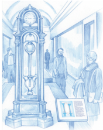
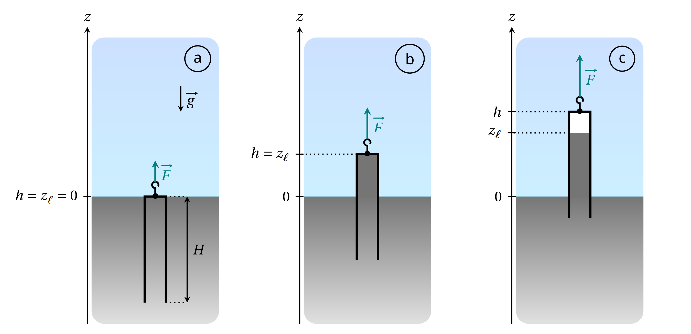
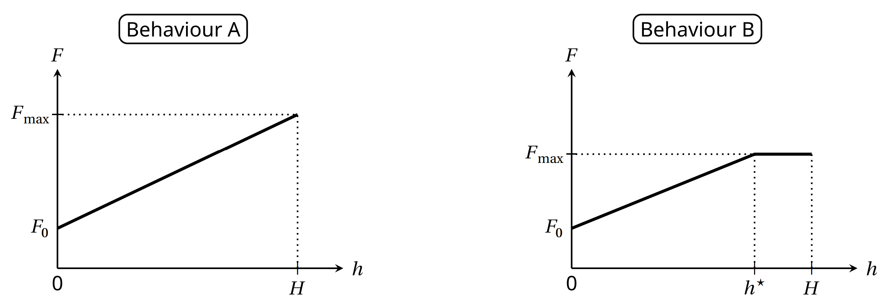
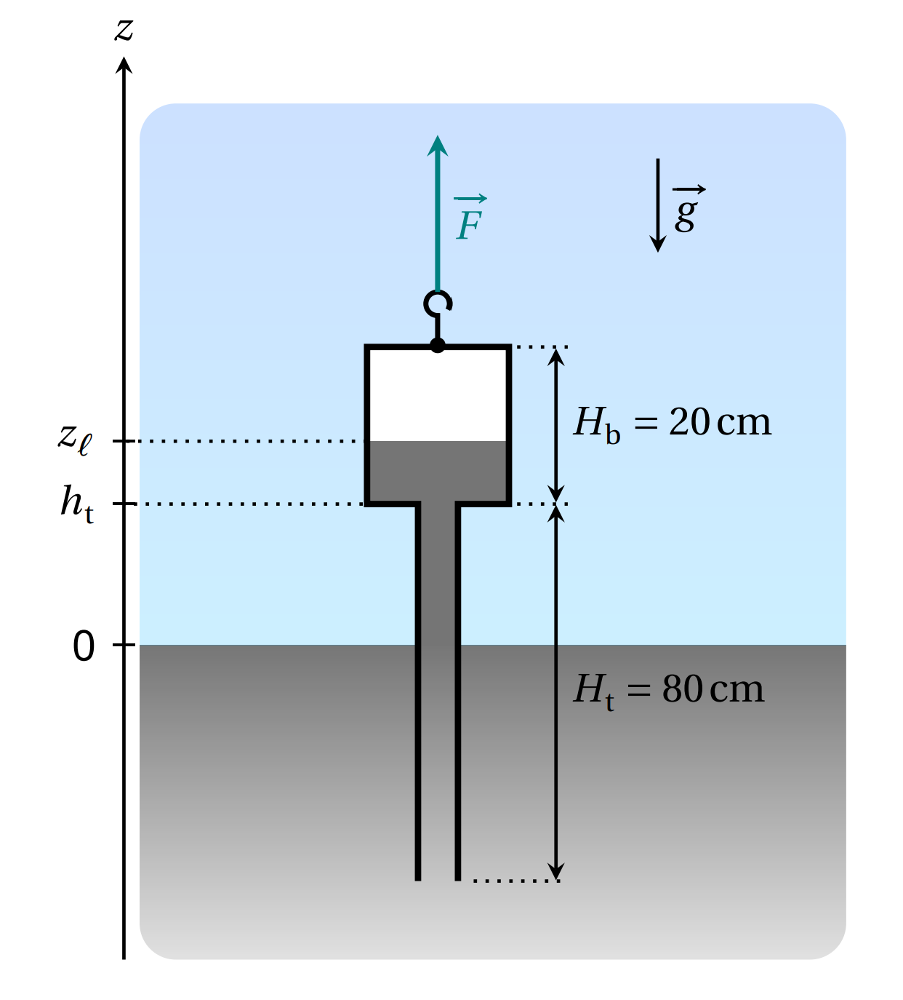
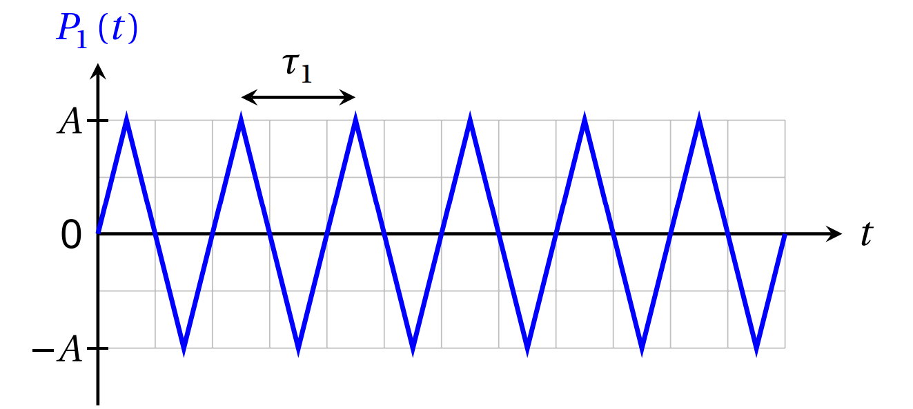
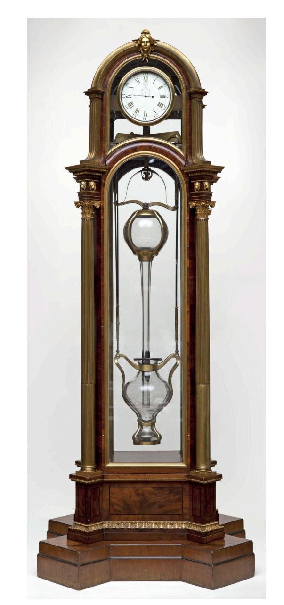
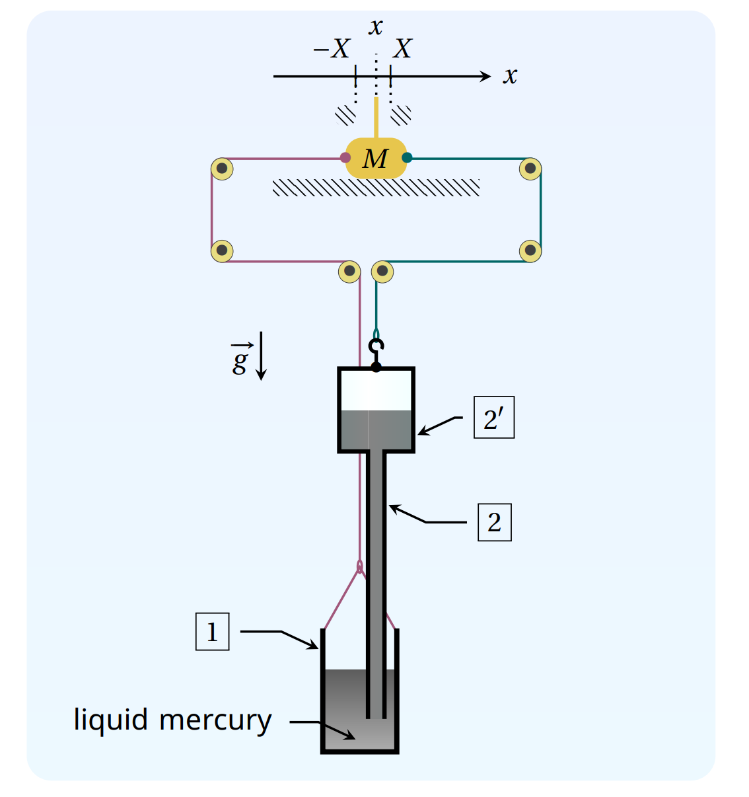

# Cox's Timepiece (10 points)

In 1765,British clock maker James Cox invented a clock whose only source of energy is the fluctuations in atmospheric pressure. Cox's clock used two vessels containing mercury. Changes in atmospheric pressure caused mercury to move between the vessels,and the two vessels to move relative to each other. This movement acted as an energy source for the actual clock.

We propose an analysis of this device. Throughout we assume that: the Earth's gravitational field. ${\vec{g} }= - g$ ${\vec{u} }_{z}$ is uniform with $g= 9. 8$m$\cdot \mathrm{s} ^- 2$ and $\vec{u}_{z}$ a unit vector; all liquids are incompressible and their density is denoted $\rho$; no surface tension effects will be considered; the variations of atmospheric pressure with altitude are neglected the surrounding temperature $T_{\mathrm{a}}$ is uniform and all transformations are isothermal

Fig.1. Artistic view of Cox's clock

## Part A - Pulling on a submerged tube

We first consider a bath of water that occupies the semi-infinite space $z\leq0$ .The air above it is at a pressure $P_{\mathrm{a}}=P_{0}$ .A cylindrical vertical tube of length $H=1$m , cross-sectional area $S=10\mathrm{cm}^{2}$ and mass $m=0.5$kg is dipped into the bath.The bottom end of the tube is open,and the top end of  the tube is closed. We denote $h$ the altitude of the top of the tube and $z_{\ell}$ that of the water inside the tube. The thickness of the tube walls is neglected

Fig.2. Sketch of the tube in different configuration

We start from the situation where the tube in Fig.2 contains no gas and its top is at the bath level: in other words, $h=0$ and $z_{\ell}=0$ (case a). The tube is then slowly lifted until its bottom end reaches the bath level. The pulling force exerted on the tube is denoted $\overrightarrow{F}=F\overrightarrow{u_z}$

A.1 For the configuration shown in Fig.2(case b),express the pressure $P_{\mathrm{w}}$ in the water at the top of the tube. Also express the force $\overrightarrow{F}$ necessary to maintain the tube at this position. Expressions must be written in terms of $P_{0}$, $\rho$, $m$, $S$, $h$, $g$ and $\vec{u}_{z}$

Three experiments are performed.In each,the tube is lifted from the initial state shown in Fig.2 (a) under the conditions specified in Table 1.

| Experiment | Liquid | $T_4$ (°C) | $\rho \ (kg.m^{-3})$ | $P_{sat}$ (Pa) |
|------------|----------|-----------|----------------------|---------------|
| 1 | Water | 20 | $1.00\times10^3$ | $2.34\times10^3$ |
| 2 | Water | 80 | $0.97\times10^3$ | $47.4\times10^3$ |
| 3 | Water | 99 | $0.96\times10^3$ | $99.8\times10^3$ |

Table 1. Experimental conditions and numerical values of physical quantities for each experiment

$P_{\mathrm{sat}}$ designates the saturated vapour pressure of the pure fluid)

In each case, we study the evolution of the force $F$ that must be applied in order to maintain the tube in equilibrium at an altitude $h_{\prime}$ the external pressure being fixed at $P_{\mathrm{a}}=P_{0}=1.000\times10^{5}$Pa .Two different behaviors are possible, as shown in Fig. 2-b.

Fig. 2-b. Different Behaviours.

A.2 For each experiment, complete the table in the answer sheet to indicate the expected behavior and the numerical values for $F_{\mathrm{max}}$ and for $h^{\star}$ (when pertinent), where $F_{\mathrm{max}}$ and $h^{\star}$ are defined in the figures illustrating the two behaviors.

| Experiment | Behavior (A or B) | $h^\star$(cm) | $F_{max}$(N) |
| ---------- | ----------------- | ------------- | ------------ |
| 1          |                   |               |              |
| 2          |                   |               |              |
| 3          |                   |               |              |

When we replace the water with liquid mercury (whose properties are given below),behavior B is observed.

| Experiment | Liquid | $T_a$ (°C) | $\rho \ (kg.m^{-3})$ | $P_{sat}$ (Pa) |
| ---------- | ------ | ---------- | -------------------- | -------------- |
| -          | Liquid | 20         | $13.5\times10^3$     | $0.163$        |

A.3 Express the relative error, denoted $\varepsilon$ , committed when we evaluate the maximal force $F_{\mathrm{max}}$ neglecting $P_{\mathrm{sat}}$ compared toe $P_0$ . Give the numerical value of e.

### Part B - Two-part barometric tube.

From now on,we work with mercury (density $\rho=13.5\times10^{3}$kg$\cdot\mathrm{m}^{-3})$ at the ambient temperature $T_{\mathrm{a}}=20^{\circ}$C and we take $P_{\mathrm{sat}}=0$.

Let us consider a tube with a reservoir on top, modeled as two superposed cylinders of different dimensions, as shown in Fig. 3.

·the bottom part(still called the tube) has cross-sectional area $S_{\mathrm{t}}$ and height. $H_{\mathrm{t}}=80$cm 

·the top part (called the bulb)has cross-sectional area $S_{\mathrm{b}}>S_{\mathrm{t}}$ and height $H_{\mathrm{b}}=20$cm

This two-part tube is dipped into a semi-infinite liquid bath.

Fig. 3. Sketch of the two-part barometric tube

As in Part A,the system is prepared such that the tube contains no air. Weidentify the vertical position of thereby the altitude $h_{\mathrm{t}}$ of the junction between the tube and the bulb. The height of the column. of mercury is again denoted $z_{\ell}$ .The force $\overrightarrow{F}$ that must be exerted to maintain the tube in equilibrium in the configuration shown in Fig.3 can now be written as

$$\overrightarrow{F}=\begin{pmatrix}m_{\mathrm{tb}}+m_{\mathrm{add}}\end{pmatrix}g\:\overrightarrow{u_{z}}$$

where $m_\mathrm{tb}$ is the total mass of the two-part tube(when empty of mercury)

B.1 On the answer sheet,colorthe area corresponding to the volume of liquid mer-0.3pt cury that is responsible for the term $m_\mathrm{add}$ appearing in equation (1)

The mass $m_{\mathrm{add}}$ depends both on the height $h_{\mathrm{t}}$ and the atmospheric pressure $P_{\mathrm{a}}$. For the next question assume that the atmospheric pressures fixed at $P_{\mathrm{a}}=P_{0}=1.000\times10^{5}$Pa . Starting from the situation where. the system is completely submerged,the tubeis slowly lifted until its base is flush with the liquid bath.

B.2 Sketch the evolution of the mass $m_\mathrm{add}$ as a function of $h_{\mathrm{t}}$ for $h_{\mathrm{t}}\in[-H_{\mathrm{b}},H_{\mathrm{t}}]$ .On the graph, provide the expression for the slopes of the different segments, as well as the $h_{\mathrm{t}}$ analytical value of any angular points, in terms of $P_0, \rho,g$, $S_{\mathrm{b}}$, $S_{\text{t}}$ $H_{\mathrm{b}}$ and $H_{\mathrm{t}}$.

As the system is lifted while $P_{\mathrm{a}}=P_{0}=10^{5}$Pa we stop when the free surface of the liquid is in the middle of the bulb. The value of $h_{\mathrm{t}}$ is fixed and then we observe variations in the mass $m_{\mathrm{add}}$ due to variations in. the atmospheric pressure described by

$$P_\mathrm{a}\left(t\right)=P_0+P_1\left(t\right)$$

where $P_{0}$ designates the average value and $P_{1}$ is a perturbation term. We model $P_1$ by a periodic triangular function of amplitude $A=5\times10^{2}$ Pa and period $\tau_{1}$ of 1-week

Fig.4. Simplified model of the perturbative term $P_1\left(t\right)$

B.3 Given that $S_{\mathrm{t}}=5\mathrm{~cm}^{2}$ and $S_{\mathrm{b}}=200\mathrm{cm}^{2}$ ,express the amplitude $\Delta m_\mathrm{add}$ of the variations of the mass $m_{\mathrm{add}}$ over time,then give its numerical value. Assume that the liquid surface always stays in the bulb.

## Part C - Cox's timepiece

The real mechanism developed by Cox is complex (Fig. 5). We study a simplified version, depicted in Fig 6,and described below:

·a cylindrical bottom cistern containing a mercury bath;

·a two-part barometric tube identical to that studied in part B, which is still completely emptied of any air, is dipped into the bath ;

·the cistern and the two-part tube are each suspended by a cable. Both cables (assumed to be inextensible and of negligible mass) pass through a system of ideal pullies and finish attached to either side of the same mass $M$ , which can slide on a horizontal surface ;

·the total volume of liquid mercury contained in the system is $V_{\ell}=5$L

The height,cross-section and masses of each part are given in Table 2. The position of mass $M$ is referenced by the coordinate $x$ of its center of mass. We consider solid friction between the horizontal support and the mass $M$ , without distinction between static and dynamic coefficients; the magnitude of this force when sliding occurs is denoted $F_{\mathrm{s}}$

Two stops limit the displacement of the mass $M$ such that $-X\leq x\leq X$ (with $X>0$ ). Assume that the value of $X$ guarantees that

 the bottom of the two-part tube never touches the bottom of the cistern nor comes out of the liquid bath;

·the altitude $z_{\ell}$ of the mercury column is always in the upper bulb

Fig. 5. Real Cox's timepiece 2 (without mercury)

Fig.6.Sketch of the system modeling the timepiece

| Reference | Name | Height | Cross section area | Empty mass |
|-----------|------|--------|-------------------|------------|
| 1   | cistern | $H_{c}=30\text{cm}$ | $S_{c}=210\text{cm}^{2}$ | $m_{c}$ |
| 2   | tubular part of the barometric tube | $H_{t}=80\text{cm}$ | $S_{t}=5\text{cm}^{2}$ | total mass of the barometric tube : $m_{tb}$ |
| 2'  | bulb of the barometric tube | $H_{b}=20\text{cm}$ | $S_{b}=200\text{cm}^{2}$ |total mass of the barometric tube : $m_{tb}$|

Table 2. Dimensions and notations for the model system

The system evolves in contact with the atmosphere,whose pressure fluctuates as in Fig.4 (still with amplitude $A=5\times10^{2}Pa$  and period $\tau_{1}=1$ week). At the start $t=0$ the mass $M$ is at rest at $x=0$ and the tensions exerted by the two cables on either side of the mass $M$ are in balance while. $P_{1}\left(0\right)=0$ . We define

$$\xi=\frac{S_{\mathrm{b}}+S_{\mathrm{c}}-S_{\mathrm{t}}}{S_{\mathrm{b}}S_{\mathrm{c}}}\:\frac{F_{\mathrm{s}}}{A}\simeq\frac{S_{\mathrm{b}}+S_{\mathrm{c}}}{S_{\mathrm{b}}S_{\mathrm{c}}}\frac{F_{\mathrm{s}}}{A}$$

where the last expression uses that $S_{\mathrm{t}}\ll S_{\mathrm{b}}$ $S_{\mathrm{c}}$ (which we will assume is valid until the end of the problem)

C.1 Determine the threshold $ξ^*$ such that M remains indefinitely at rest when $ξ > ξ^*$.

For the next question only,suppose that the mass $M$ is temporarily blocked at $x=X$

C.2 Give an expression for the total tension force $\vec{T}=T\vec{u_{x}}$ acting on the mass $M$ due to the tension in two cables at this position, when $P_1=0$ ,in terms of $\rho,g,X$ and pertinent cross-sections.

When $\xi<\xi^{\star}$ starting again from $x=0$ and $P_{1}=0$ , two different behaviors can be observed for $t\geq0$ To distinguish them, we need to introduce another parameter.

$$\lambda=\frac{2\left(S_\mathrm{b}-S_\mathrm{t}\right)}{S_\mathrm{b}}\:\frac{\rho\:g\:X}{A}\simeq\frac{2\:\rho\:g\:X}{A}$$

C.3 Complete the table in the answer sheet to indicate the condition under which each regime is obtained. Conditions must be expressed as inequalities on $\xi$ and/or $\lambda$. In addition, sketch the variations of $x(t)/X$ for $t \in [0, 3\tau_1]$ that are consistent with the variations of $P_1(\tau)/A$ already present. Specification of remarkable points coordinates is not required.

|          | Condition for Observation           | Graph of x(t)/X                        |
| -------- | ----------------------------------- | -------------------------------------- |
| Regime 1 | cistern                             | Please describe what x(t)/X looks like |
| Regime 2 | tubular part of the barometric tube | Please describe what x(t)/X looks like |

In the real Cox's timepiece, energy provided by the mechanism is stored using a system of ratchets and used to raise a counterweight,like in a traditional clock. In the simplified model studied here,the energy recovered by the clock corresponds to the energy dissipated by the friction force exerted by the horizontal surface on the mass $M$ . From now on, we assume that the system is dimensioned such that to work in the regime that allows the clock to recuperate energy. We also assume that the permanent regime is established. We denote $W$ the energy dissipated by the solid friction force during a period $\tau_{1}$, which can be expressed only in terms of $F_s$ and $X$

All else equal, $F_{\mathrm{s}}$ and $X$ can be adjusted to maximize the energy W; we denote $F_{\mathrm{s}}^{\star}$ and $X^{\star}$ their respective values in the optimal situation

C.4 Considering $S_b\simeq S_c$, and $S_t << S_b$, determine the expressions for $F_s^*$ and $X^*$ as functions of $\rho$, $g$, $S_c$, and $A$. Express the numerical value of maximum energy $W^*$, then calculate its numerical value with $A = 5 \times 10^{2}$ Pa.

We denote $W_{\mathrm{pr}}^{\star}$ the work of atmospheric pressure forces received by the system in the optimal situation during a period $\tau_1$

C.5 Express $W_{\text{pr}}^*$, then calculate the ratio $\frac{W^*}{W_{\text{rev}}^*}$. It could be useful to represent the evolution of the system in a $(P,V)$ diagram, where $V$ is the system's volume.
